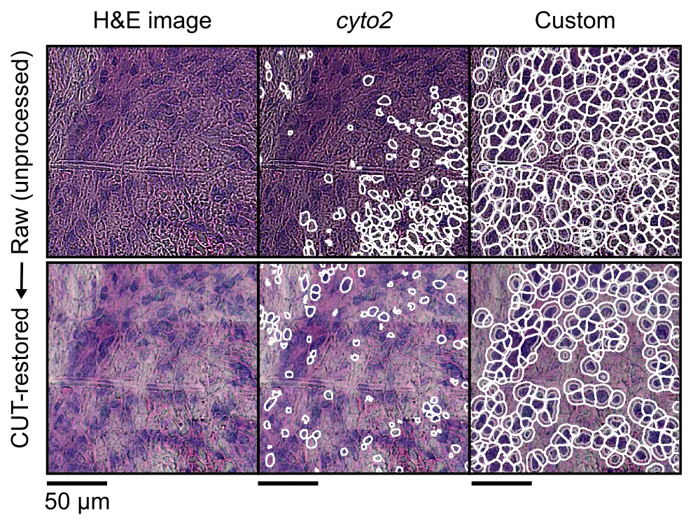

# Pairwise alignment
In the previous step, you processed and mapped transcriptomic reads into spatial coordinates with `spacemake`.
Before aggregating transcriptomic information per cell, we need to align this transcriptomic data into tissue space,
leveraging imaging data.

`openst` can [automatically] (or [manually]) perform pairwise alignment of transcriptomic and imaging modalities,
via advanced computer vision algorithms. Alignment is performed in two steps:

1. Coarse (low-resolution) of H&E images to pseudoimages of ST data, to **roughly align the transcriptome to the tissue**.
2. Fine (high-resolution), using **fiducial marks** detected at both modalities for **sub-micron accurate alignment**.

[automatically]: #option-a-automated-alignment
[manually]: #option-b-manual-alignment

## Data required
Two data modalities are used for pairwise alignment: 

1. A single Open-ST h5 object (from [`spacemake`](preprocessing_openst_library.md)) containing all the spatially-resolved locations of a sample.
2. A single, high-resolution image of the capture area and tissue

### Tissue transcriptome
If you ran `spacemake` with a `puck` with a `coordinate_system`, **and** a `run_mode` without meshing, e.g.:

```yaml
pucks:
  openst:
    coordinate_system: puck_data/openst_coordinate_system.csv
    spot_diameter_um: 0.6
    width_um: 1200
...
run_modes:
  openst:
    clean_dge: false
    count_intronic_reads: true
    count_mm_reads: true
    detect_tissue: false
    mesh_data: false
    mesh_type: 'hexagon'
    n_beads: 100000
    polyA_adapter_trimming: true
    spatial_barcode_min_matches: 0.1
```

Then you are **all set to proceed** with the [Tissue image](#tissue-image) preprocessing (unless you had the issues below).

??? question "My `run_mode` and/or `puck` do not look like that"

    It is likely that you didn't specify a `coordinate_system` or you only have `mesh`(ed) Open-ST h5 objects, 
    therefore you need to generate a `puck_collection` Open-ST h5 object, manually:

    ```sh
    openst from_spacemake \
        --project-id openst_demo_project \
        --sample-id openst_demo_sample \
        spatial_stitch \
        --tile-coordinates fc_1_coordinate_system.csv
    ```

    Please replace `--tile-coordinates` with the adequate coordinate_system for your barcoded flow cell.
    This one is available under the [examples section](https://rajewsky-lab.github.io/openst/latest/examples/datasets)

    If you want to select only specific tiles for a sample, e.g., to exclude some spurious tiles, 
    you can `puck_collection` files fully manually, without the `from_spacemake` command: 

    ```sh
    openst spatial_stitch \
        --tiles dge.fc_1_tile_2267.h5ad dge.fc_1_tile_2268.h5ad \
        --tile-id fc_1_tile_2267 fc_1_tile_2268 \
        --tile-coordinates fc_1_coordinate_system.csv \
        --h5-out spatial_stitched_spots.h5ad
    ```

### Tissue image
The tissue transcriptome data you just preprocessed will be aligned into a tissue (hi-res) image.
For this, `openst` expects a single, high-resolution `tiff` image
where the tissue is visible (and preferrably at least a small part of the capture area, too).

Expand one of the cases below to decide how to proceed with image data:
??? question "My microscope gives a single, hi-res image"
    Fantastic! Just copy it to the relevant `spacemake` subfolder for the specific project and sample, 
    for instance:

    ```sh
    spacemake_folder
    `-- projects
        `-- <project_id>
            `-- processed_data
                `-- <sample_id>
                    `-- imaging # you might need to create
                        `-- Image_Stitched_Composite.tif # copy with this name
    ```

    **Make sure** to copy the image to that location, with the name `Image_Stitched_Composite.tif`.
    ```bash
    projects/openst_demo_project/processed_data/openst_demo_sample/imaging/Image_Stitched_Composite.tif
    ```


??? question "My microscope doesn't give a single image, but many _tile_ files"
    When performing imaging, i.e. as tile-scans, you might need to assemble a single,
    large image from a collection of smaller tiles (fields-of-view, FOVs). 

    We provide tools to perform tile stitching from raw data with the microscopy setup showcased in
    [our implementation](../experimental/library_preparation.md#he-staining-and-imaging) (a Keyence
    BZ-X710 inverted fluorescence phase contrast microscope). If you use a different microscope setup, 
    please refer to the documentation of your microscope for how to stitch tile-scans into a single image.

    For this keyence microscope, copy the raw data (including `*.tiff` and `.bcf` files) into the
    `spacemake` folder specific for that project and sample:

    ```sh
    spacemake_folder
    `-- projects
        `-- <project_id>
            `-- raw_data
                `-- imaging # you might need to create it
                    `-- <sample_id>
                        |-- Image.bcf
                        `-- *.tif
    ```
    
    Then, run:
    ```bash
    openst image_stitch \
        --microscope='keyence' \
        --imagej-bin=<path_to_fiji_or_imagej> \
        --image-indir=projects/<project_id>/raw_data/imaging/<sample_id> \
        --image-out=projects/<project_id>/processed_data/<sample_id>/imaging/Image_Stitched_Composite.tif
    ```

    This leverages the Grid/Collection stitching plugin included in [Fiji](https://imagej.net/software/fiji/downloads) 
    to create a single, composite tile-scan image. Replace `<path_to_fiji_or_imagej>` with the path where the
    [Fiji](https://imagej.net/software/fiji/downloads) executable is.

    !!! question
        If you don't know how to specify the `<path_to_fiji_or_imagej>`, please follow the official instructions provided
        for [Running Headless](https://imagej.net/learn/headless). For example, under linux you can download it using

        ```bash
        cd ~
        wget "https://downloads.imagej.net/fiji/latest/fiji-linux64.zip"
        unzip fiji-linux64.zip
        # then, <path_to_fiji_or_imagej> will be "~/Fiji.app/ImageJ-linux64"
        ```

    !!! note
        If your imaging setup consisted of a Z-stack, each tile image will likely be a FOV and a specific Z plane 
        (e.g., file names like Image_00001_Z001.tif, Image_00001_Z002.tif,...). In this case, you can specify a 
        regular expression (regex) to parse the Z plane from the file names, and a single file per FOV 
        will be created before stitching. 
        
        This can be specified in `openst image_stitch` with the argument `--join-zstack-regex` (empty, by default)

Either way, `openst` expects a
single `.tif` file at `projects/<project_id>/processed_data/<sample_id>/imaging/Image_Stitched_Composite.tif`.

Unless you had the issue below...

??? warning "The quality of images is suboptimal (e.g., for segmentation)"
    Most of the times, large tile-scans may have uneven illumination, focus or noise. This can be challenging for downstream
    processing, like segmentation, feature extraction or quantification (i.e., of fluorescence images). 
    There is a plethora of methods to address these issues (e.g., [Flatfield Correction](https://imagej.net/plugins/bigstitcher/flatfield-correction)
    from *BigStitcher*, or [CARE](https://imagej.net/plugins/care), to name some). This might be highly dependent on your microscope,
    imaging settings, sample type, sample width... **Always look at your images** so you can take an informed decision.

    In our publication, we leveraged a [CUT](https://github.com/taesungp/contrastive-unpaired-translation) model that allowed
    to homogeneize the *style* of the whole tile-scan - that is, reduce possible biases in illumination, noise and focus across the entire
    tile-scan. You can run this by running the following command on the stitched image.

    { loading=lazy }

    ```bash
    openst image_preprocess \
        --image-in Image_Stitched_Composite.tif \
        --image-out Image_Stitched_Composite_Restored.tif
        # --device cuda # in case you have a CUDA-compatible GPU
    ```

    If you ran `openst merge_modalities`, then imaging data will be contained inside the Open-ST h5 object, and the command
    can be adapted:

    ```bash
    openst image_preprocess \
        --h5-in multimodal/spots_stitched.h5ad # just a placeholder, adapt
        # --device cuda # in case you have a CUDA-compatible GPU
    ```

    By default, the image will be loaded from the key `uns/spatial/staining_image`, and the CUT-restored image will be saved
    to `uns/spatial/staining_image_restored`. You can preview the image restoration results using:

    ```bash
    openst from_spacemake \
        --project-id openst_demo_project \
        --sample-id openst_demo_sample \
        --image-key uns/spatial/staining_image uns/spatial/staining_image_restored
    ```

    This will load the two images and visualize it using `napari`. Later, you can run segmentation and pairwise alignment
    using either the default merged image (`uns/spatial/staining_image`), or the restored image (`uns/spatial/staining_image_restored`).
    Always assess these preprocessing choices (quantitatively and qualitatively) to decide whether these make sense for your data.

    Once the single image has been generated, make sure that the image is the full-resolution
    and not a downsampled version. As a rule of thumb, at least a few fiducial markers must be clearly distinguishable.

... you are **all set to proceed with pairwise alignment**.

## Merging data modalities
Once the ST and imaging data have been stitched, you can create a single object containing both modalities:

```sh
openst from_spacemake \
     --project-id openst_demo_project \
     --sample-id openst_demo_sample \
     merge_modalities
```

## Pairwise alignment
From the merged object you created above, you can do pairwise alignment of the transcriptomic
data into the tissue image automatically, semiautomatically, or fully manually:

=== "Automatic (or semiautomatic) alignment"

    For aligning transcriptomic data into H&E-stained tissue sections, **we recommend** leaving 
    the rest of arguments with default parameters - you can get a full list of configurable parameters
    by running `openst pairwise_aligner --help`.

    ``` sh
    openst from_spacemake \
          --project-id openst_demo_project \
          --sample-id openst_demo_sample \
          pairwise_aligner
          # --metadata alignment.json # to create a visual report
          # --only-coarse for semiautomatic
    ```

    When running automatic alignment, the spatial keys will be:
    1. `obsm/spatial`: the original (unaligned) coordinates
    2. `obsm/spatial_pairwise_aligned_coarse`: after low-res alignment
    3. `obsm/spatial_pairwise_aligned_fine`: after hi-res refinement

    Similarly, the aligned image will be saved under `uns/spatial_pairwise_aligned/staining_image_transformed`.

    Therefore, if you want to visualize with the GUI or perform manual fine-tuning of the alignment, you
    need to specify the correct `--spatial-key` and `--image-key`:

    ```bash
    # for visualization and/or manual fine-tuning
    openst from_spacemake \
          --project-id openst_demo_project \
          --sample-id openst_demo_sample \
          manual_pairwise_aligner \
          --spatial-key obsm/spatial_pairwise_aligned_fine \
          --image-key uns/spatial_pairwise_aligned/staining_image_transformed

    # if you want to perform semiautomatic alignment,
    # continue with openst manual_pairwise_aligner
    # see "Manual alignment" tab
    ```
    
    Also, in some of the following steps (e.g., [segmentation](generate_expression_matrix.md)), make sure to populate 
    the `--image-key` and `--spatial-key` arguments with the correct values.

=== "Manual alignment"
    We provide a Graphical User Interface (GUI) for selecting keypoints between imaging & ST modalities, 
    for full manual alignment or refinement of automatic results. This GUI requires a single Open-ST h5 object
    (after spatial stitching). There are two kinds of workflow:

    ``` sh
    openst from_spacemake \
          --project-id openst_demo_project \
          --sample-id openst_demo_sample \
          manual_pairwise_aligner \
          --spatial-key obsm/spatial \
          --image-key uns/spatial/staining_image
    ```
    
    In the GUI, you first perform _coarse_ alignment (**not** tile by tile), and then click 'Apply to data'.
    Save the transformed coordinates as `obsm/spatial_manual_coarse`. Then, re-render with with spatial key,
    select at least 3 corresponding keypoints per tile, and save a keypoints file, e.g., as `keypoints.json`.

    Then you can apply the transformation, per tile, separately:

    ```bash
    openst from_spacemake \
          --project-id openst_demo_project \
          --sample-id openst_demo_sample \
          apply_transform \
          --keypoints-in keypoints.json \
          --spatial-key-in obsm/spatial_manual_coarse \
          --spatial-key-out obsm/spatial_manual_fine \
          --per-tile
    ```

    This will save the refined (similar to automatic hi-res alignment) coordinates into `obsm/spatial_manual_fine`.
    The image data will still be (by default) under `uns/spatial/staining_image`. Make sure to populate `--image-key` 
    and `--spatial-key` arguments in later steps with the correct values.

    We provide a video tutorial showcasing the GUI, with an illustrative example 
    of refinement from (only coarse) automatic alignment.

    ---

    :fontawesome-brands-youtube:{ style="color: #EE0F0F" }
    __[Walkthrough of the GUI for manual alignment]__ by @danilexn – :octicons-clock-24:
    5m – Learn how to visualize and align STS and imaging data in a step-by-step guide.

    [Walkthrough of the GUI for manual alignment]: https://youtu.be/Fjh4huosVPY

    ---
    
Now you are **all set to proceed with the visual (qualitative) assessment of the alignment** (unless you had the issues below).

??? question "The coarse (or fine) alignment didn't work"
    There are several parameters that you can change.

    The most important ones are:
        - `--rescale-factor-coarse` or `--rescale-factor-fine`: the highest, the lower resolution the image; thus, more _global_ features are used for registration
        - `--threshold-counts-coarse` or `--threshold-counts-fine`: the highest, the less spots there will be on the image
    
    These allow to increase the number of matches and possibly the number of RANSAC inliers. There are other RANSAC-specific parameters that can be changed, such as `--ransac-coarse-residual-threshold`, `--ransac-coarse-max-trials` and `--ransac-fine-min-samples`. For more parameters, check `openst pairwise_aligner --help`.

??? warning "I get an error: 'This application failed to start [...]'"
    In some environments, the following error might happen:
    
    ```sh
    qt.qpa.plugin: Could not load the Qt platform plugin "xcb" in "/home/user/miniconda3/envs/openst/lib/python3.11/site-packages/cv2/qt/plugins" even though it was found.

    This application failed to start because no Qt platform plugin could be initialized. Reinstalling the application may fix this problem.

    Available platform plugins are: xcb, eglfs, linuxfb, minimal, minimalegl, offscreen, vnc, wayland-egl, wayland, wayland-xcomposite-egl, wayland-xcomposite-glx, webgl.
    ```

    This can be solved by removing the files inside `/home/user/miniconda3/envs/openst/lib/python3.11/site-packages/cv2/qt/plugins`, e.g. see this [StackOverflow thread](https://stackoverflow.com/questions/71029300/python-pyqt-xcb-plugin-with-thread-error)
    
## Visual assessment of alignment
### With HTML report
With automatic alignment, if you specified the `--metadata` argument, you can generate an HTML report
showing a qualitative summary of the alignment (images, parameters...)

```sh
openst report --metadata=alignment.json --html-out=alignment_report.html
```

### With interactive GUI
Alternatively, you can visualize the images & ST data interactively using the integrated interactive GUI.

```sh
openst manual_pairwise_aligner
```

We provide a Graphical User Interface (GUI) for selecting keypoints between imaging & ST modalities, 
for visualization and refinement of automatic results. This GUI requires a single Open-ST h5 object,
the output of `openst pairwise_aligner`.

## Expected output
After automatic or manual alignment, you will have a single `h5ad` file, containing the transformed spatial coordinates.
This will be used in the following step to aggregate the transcripts by a spatially-corresponding cell, in order to get a cell-by-gene
matrix that can be used in later downstream analysis.
