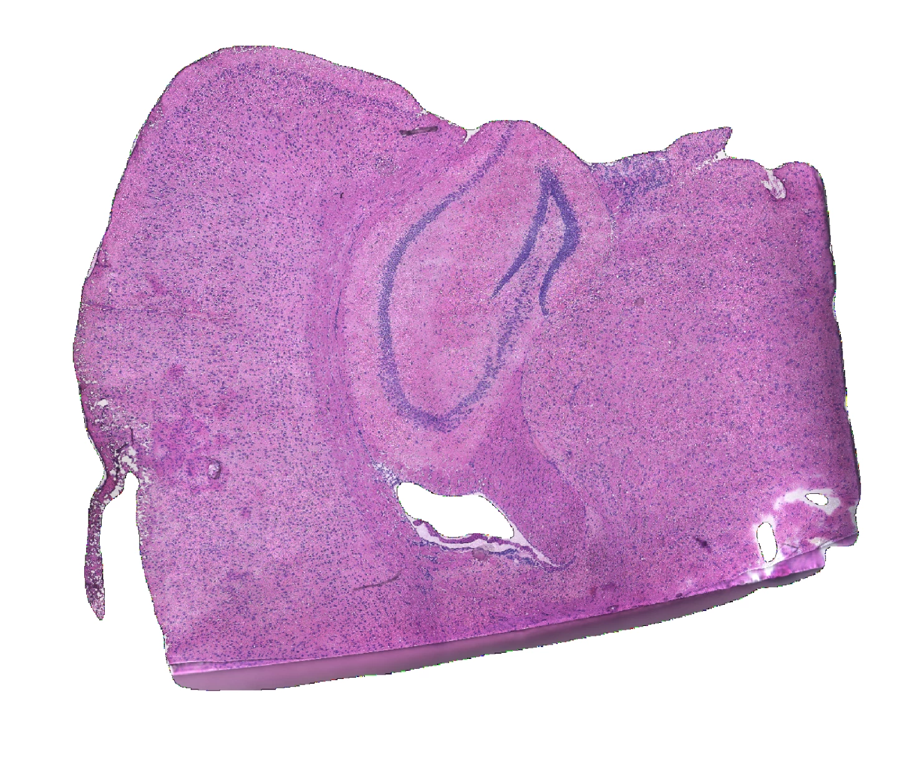

# Pairwise alignment

In the previous step, the transcriptomic reads were processed and mapped in tissue space with `spacemake`.
Now, we perform a pairwise alignment between the imaging and spatial transcriptomics modality, such that
we can later aggregate transcripts into individual cells delimited by the segmentation mask.

We will illustrate how to do this in a semiautomatic manner: that is, running the coarse alignment in
an automatic fashion, and the fine alignment (to fiducial marks) via GUI, in a manual manner. Although we
provide models for fiducial feature detection, the accuracy might be affected by the type of microscope,
imaging strategy, tissue type and width... Thus, manual fine alignment is a good option. This can be done
very quickly thanks to the GUI specifically designed for this task (~5 minutes per sample of 12 tiles).


## Download and copy image data

For this dataset, we archived the [stitched tile-scan image](https://bimsbstatic.mdc-berlin.de/rajewsky/openst-public-data/adult_mouse_hippocampus.tif). 
This single image was generated from multiple, independently imaged tiles, by leveraging `openst image_stitch`. So, 
you don't need to use this command, since we already provide the stitched image. Anyway, let us know
if you want access to this tile images, in case you want to try.

As well, the imaging from this dataset did not require any further postprocessing prior to segmentation,
as visual inspection of the images did not reveal any strong illumination or focus biases. 

{ loading=lazy width=300}

You can download the image data from the link above

```bash
wget "https://bimsbstatic.mdc-berlin.de/rajewsky/openst-public-data/adult_mouse_hippocampus.tif"
```

and then copy it into relevant path, for example:

```bash
mkdir spacemake_folder/projects/openst_demo/processed_data/openst_demo_adult_mouse/imaging
cp adult_mouse_hippocampus.tif \
    spacemake_folder/projects/openst_demo/processed_data/openst_demo_adult_mouse/imaging/Image_Stitched_Composite.tif
```


the final folder structure should look like:

```sh
spacemake_folder
`-- projects
    `-- openst_demo
        `-- processed_data
            `-- openst_demo_adult_mouse
                `-- imaging
                    `-- Image_Stitched_Composite.tif
```

## Merging data modalities

From the relevant `spacemake` main folder, merge both transcriptomics and imaging modalities

```bash
openst from_spacemake \
    --project-id openst_demo \
    --sample-id openst_demo_adult_mouse \
    merge_modalities
```


## Coarse pairwise alignment (auto)
Once the two modalities have been merged, you can run automatic alignment. Here we only run coarse (`--only-coarse`),
so we can showcase how to do manual refinement with the GUI.

```sh
openst from_spacemake \
    --project-id openst_demo \
    --sample-id openst_demo_adult_mouse \
    pairwise_aligner \
    --only-coarse \
    --device cuda
```

!!! note
    For this image data, and the spatial coordinates after alignment, the conversion factor to physical distance is **1 pixel = 0.345 µm**.

## Fine pairwise alignment (manual)

Now you can assess the pairwise alignment visually, and refine it using the provided GUI tool. 

```sh
openst from_spacemake \
    --project-id openst_demo \
    --sample-id openst_demo_adult_mouse \
    manual_pairwise_aligner \
    --spatial-key obsm/spatial_pairwise_aligned_coarse \
    --image-key uns/spatial_pairwise_aligned/staining_image_transformed
```

Then, follow the following steps:

1. Select the *all_tiles_coarse* layer from the *Layer selector*, and click on *Render*. You will see the staining image on the upper left,
   the transcriptomic image on the top right, and the merge on the bottom left. These two modalities should *roughly* match. If not, you would need to
   run the coarse (low-res) alignment in manual mode, too.
2. If the coarse alignment looks good, select layer '0' and click *Render*.
3. Select pairs of corresponding fiducial markers (at least 3) on both modalities by double clicking on the left image, first, and on the right image, second. You can drag the points to new locations, zoom into the images with the mouse wheel, pan the image by holding the mouse right cursor and moving, and remove the points by pressing backspace on your keyboard. You can preview how the alignment will look like after transformation by pressing *Preview alignment*.
4. Repeat from 2, but selecting a new layer every time ('1', '2', ...).
5. Once you've finished with all tiles, go under *Keypoint properties* and click *Save keypoints* as `keypoints.json`.

With this, you have created a `keypoints.json` file containing pairs of corresponding points between the
spatial trancriptome and image modalities. 

## Apply keypoint transformation
Then, compute apply the rigid transformations to the coarsely aligned spatial coordinates:

```sh
openst from_spacemake \
    --project-id openst_demo \
    --sample-id openst_demo_adult_mouse \
    apply_transform \
    --keypoints-in keypoints.json \
    --spatial-key-out obsm/spatial_manual_fine \
    --per-tile
```

The `--per-tile` is important to perform this operation per tile. Otherwise, `apply_transform` will assume
that the transform needs to be done for all coordinates, and will expect that you have selected corresponding
keypoints for the layer *all_tiles_coarse*.

That's it! Now you're ready to go to the next step.