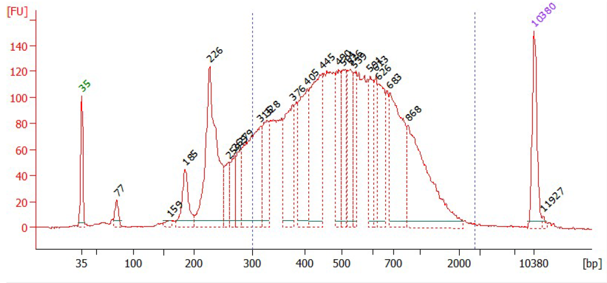

# Library preparation

:fontawesome-brands-youtube:{ style="color: #EE0F0F" }
__[Open-ST: capture area handling]__ by Marie Schott & Anastasiya Boltengagen – :octicons-clock-24:
1m – Tips and tricks on handling the capture areas during library preparation.

  [Open-ST: capture area handling]: https://youtu.be/9DF4NMRMCMw

---

## Tissue sectioning

!!! note "Before starting" 

    Before sectioning, place the OCT-mounted fresh frozen tissue in a cryostat for 20 minutes at the selected cutting temperature (adjusted according to tissue). Place the capture areas at room temperature. 

!!! note "Before starting" 

    Pre-cool 100% methanol at -20°C for subsequent fixation step. 

!!! Tip

    Trim the excess OCT surrounding the tissue to prevent folding of OCT under or over the tissue.  

!!! Warning 

    Remove the capture area from the stage, as soon as the transfer occured, to avoid re-freezing of the tissue onto the stage. 
   
1. Slice the tissue at the selected temperature at 10 μm thickness.
2. Place the capture area (*room temperature*) on the tissue section on the cutting stage. The tissue will melt onto the capture area.
3. Store the capture area with tissue-side up in the cryostat until fixation.

:fontawesome-brands-youtube:{ style="color: #EE0F0F" }
__[Open-ST: sectioning]__ by Marie Schott & Anastasiya Boltengagen – :octicons-clock-24:
1m – Learn how to place cryosections on your Open-ST capture area

  [Open-ST: sectioning]: https://youtu.be/0Gl_wn-gtM8

---

## Fixation 

!!! Note

    Transport samples on dry ice until placed in -20°C methanol. 

1. Fix the tissue by placing the capture area with the tissue section in a tube containing 1 mL of 100% Methanol (pre-cooled to -20°C). 
2. Incubate at -20°C for 30 min.

## Hematoxilin and eosin (H&E) staining and imaging 

:fontawesome-brands-youtube:{ style="color: #EE0F0F" }
__[Open-ST: H&E staining]__ by Marie Schott & Anastasiya Boltengagen – :octicons-clock-24:
1m – Capture area handling during staining

  [Open-ST: H&E staining]: https://youtu.be/SKIhRH46Z2s

---

**Buffered Eosin (make fresh)**

| Reagent | Volume (μL) |
|----|----|
| Eosin Y | 500 |
| 0.45M Tris-Acetate buffer pH 6.0 | 500 |

For incubations, add enough volume to cover the capture area completely. For all washes, wash by dipping in a beaker with Ultrapure water (500 mL). 

1. Add isopropanol to the tissues on the capture area and incubate for 1 min, then remove the solution and dry the tissues. 
2. Add hematoxylin, and incubate for 5 min.
3. Wash the capture area with Ultrapure water until the hematoxylin dye is completely removed (dipping 10-15x). 
4. Add bluing buffer, and incubate for 2 min. 
5. Wash the capture area with Ultrapure water, dipping 5 times. 
6. Add buffered eosin onto tissue section for 1 min.
7. Wash the capture area with Ultrapure water, dipping 10-15x. 
8. Let the capture area air-dry at room temperature for 10 min. Dry the tissues completely with no residual water. 
9. Image the tissue on brightfield with the 20x objective. (If using an inverted microscope, put the capture area face-down on a coverslip (#1.5, 24x50mm) for imaging)

After imaging, place the capture areas with the tissue section face up into a multi-well gasket, such as the 16-Well ProChamber Microarray System (Grace Bio-Labs, Cat#645508). We use 100 μL reaction volume throughout the protocol whilst using the gasket. 

:fontawesome-brands-youtube:{ style="color: #EE0F0F" }
__[Open-ST: imaging and incubating]__ by Marie Schott & Anastasiya Boltengagen – :octicons-clock-24:
1m – Imaging and incubating the Open-ST capture areas

  [Open-ST: imaging and incubating]: https://youtu.be/lmpGG6btMRc

---

## Permeabilization 

We recommend performing a pilot experiment in which you compare different permeabilization conditions using a qPCR assay. We suggest comparing different pepsin incubation times (for example, 0, 15, 30, 45, and 60 min) at 37°C.    
Follow the library preparation steps until *qPCR for cycle number assessment*. Earlier amplification corresponds to a higher concentration of starting material, ie. more efficient mRNA capture. If conditions amplify together, chose the shorter time or lower pepsin concentration for permeabilization of your sample.  

!!! Note

    To prevent evaporation use plate sealing tape to seal your multiwell chamber during all following incubations in the chamber. 

1. Weigh and dissolve the pepsin to have a solution with 7 U/ul pepsin in 2xSSC pH 2.5. 
2. Dilute 1:10 with 2xSSC pH 2.5 to get the final concentration of 0.7 U/μl.
3. Prewarm permeabilization mix (0.7 U/uL) at 37℃ several minutes before use. 
4. Incubate at 37°C for X min (ex. 15 min - 30 min - 60 min) according to the tissue used.  

## Reverse transcription 

**Reverse transcription (RT) buffer** 

|Reagent|Final concentration|Volume (μl)|
|:----|:----|:----|
|SSIV 5X rt BUFFER|1x|20|
|RNase inhibitor (40U/ul)|1U/ul|2.5|
|Ultrapure water| |77.5|
|**Total**| |**100**|

**Reverse transcription mix** 

|Reagent|Final concentration|Volume (μl)|
|:----|:----|:----|
|SSIV 5X rt BUFFER|1x|20|
|0.1M DTT|5mM|5|
|BSA (20mg/ml)|0.187mg/ml|0.93|
|10mM dNTP mix|1mM|10|
|Superscript IV (200U/ul)|6.67 U/μL|3.33|
|Ribolock(40U/μL)|1U|2.5|
|Ultrapure water| |58.24|
|**Total**| |**100**|

1. Remove the pepsin solution. 
2. Wash the capture area carefully with 100 μl RT Buffer once.
3. Add 100 μL RT mix per capture area. Seal the multiwell chamber with a piece of plate-sealing tape to prevent evaporation. Incubate overnight at 42°C. 

## Exo I digestion

**Exonuclease I mix** 

|Reagent|Final concentration|Volume (μl)|
|:----|:----|:----|
|10 x Exo I buffer|1x|10|
|Exo I|1U/ul|5|
|Ultrapure water| |85|
|**Total**| |**100**|

1. Remove the RT solution. 
2. Add 100 μL Exonuclease I mix per capture area to eliminate DNA that did not hybridize with mRNA.  
2. Seal chamber and incubate 45 min at 37℃. 

## Tissue removal 

**Tissue removal mix**	

|Reagent|Final concentration|Volume (μL)|
|:----|:----|:----|
|1M Tris-Cl pH 8.0|100 mM|10|
|2M NaCl|200 mM|10|
|20% SDS|2%|10|
|0.1M EDTA|5 mM|5|
|Proteinase K ( 800 mU/μL)|16 mU/μL|2|
|Nuclease -free water| |63|
|**Total**| |**100**|

1. Remove the Exonuclease I mix. 
2. Add 100 μl of 1x tissue removal mix per capture area, seal chamber, and incubate for 40 minutes at 37℃.
3. Wash as follows: 
    1. Wash the capture area with ultrapure water three times. 
    2. Wash the capture area  with 100 μl of freshly prepared 0.1N NaOH three times* (*each with 5 min incubation at room temperature). 
    3. Wash the capture area  with 100 μl of 0.1M Tris (pH7.5) three times. 
    4. Wash the capture area with 100 μl of Ultrapure water three times. 

!!! Note 

    Visually confirm that tissue removal is complete after washes have been completed. 

## Second strand synthesis 

**Second strand synthesis mix**

|Reagent|Final concentration|Volume (μL)|
|:----|:----|:----|
|NEBuffer-2|1x|10|
|100 uM randomer|10 uM|10|
|10 mM dNTPs|1 mM|10|
|Klenow exo (-) Fragment (5 U/μL)|0.5 U/μL|10|
|Ultrapure water| |60|
|**Total**| |**100**|

1. Add 100 μL second strand synthesis mix per capture area. Seal chamber and incubate at 37°C for 2 h. 
2. Wash with 100 μL ultrapure water 3 times. 
3. Elute the second strand product by incubating the capture areas in 100 μl of freshly prepared 0.1 N NaOH twice for 5 min each. **Recover the elutions** (=2nd strand product), pooling the two elutions per sample.
4. Mix the 200 μl of second strand product per sample with 28.6 μl of 1M Tris-HCl pH 7.5. Proceed directly to next step.

Purify the 228.6 μL elution using AmpureXP beads at a ratio of 1.8 beads to 1x second strand product (=411 μL beads/sample) , following the manufacturer's instructions.
Elute the product in 82.5 μL ultrapure water.  

## qPCR for cycle number assessment 

!!! Note 

    Use of a passive reference dye depends on the qPCR cycler used. We usually use the StepOne™ Real-Time PCR System (Applied Biosystems).  

Pipette and run a qPCR to determine the appropriate cycle number to amplify your eluted second strands. 

**qPCR mix**

|Reagent|Final concentration|Volume (μl)|
|----|----|----|
|2x Blue S'Green qPCR mix + ROX |1x|10|
|10 uM p5_fwd primer|1 uM|2|
|10 uM p7_rev_indexing primer|1 uM|2|
|Second strand product| |2.5|
|Ultrapure water| |3.5|
|**Total**| |**20**|

|Temperature|Time|Cycles|
|:----|:----|:----|
|95°C |3 min|1|
|||
|95°C|30 sec| (40)|
|60°C|1 min| (40)|
|72°C|1 min| (40)|

Derive the PCR cycle number required for the amplification of your sample as follows: 

Set a threshold at 50% of the peak ΔRn. For each sample determine the cycle number at the intersection of the threshold and amplification curve. 
Subtract 5 cycles to account fo the qPCR input (3%). This number is your recommended PCR cycle number. We expect a cycling number between 11 and 14. 

## Library construction 

### Library amplification and purification

**Library amplification mix**

|Reagent|Final concentration|Volume (μL)|
|----|----|----|
|2x KAPA HiFi Hotstart Readymix|1x|100|
|100 uM p5_fwd primer |1 uM|2|
|100 uM p7_rev_indexing primer|1 uM|2|
|Purified 2nd strand | |80|
|Ultrapure water| |16|
|**Total**| |**200**|

|Temperature|Time|Cycles|
|----|----|----|
|95°C |3 min|1|
||||
|95°C|30 sec|(To be determined)|
|60°C|1 min| (To be determined)|
|72°C|1 min| (To be determined)|
||||
|72°C|2 min|1|
|4°C|hold|

1. Prepare the library amplification mix per sample. 
2. Split each sample mix into four PCR tubes, each with 50 μL volume. 
3. Run the PCR with the cycle number determined previously (3.9). 
4. Pool the 200 μL PCR product per sample and purify using AmpureXP beads at a 1:1 ratio of beads PCR product, following the manufacturer's instructions.
5. Elute the PCR product in 20 μL ultrapure water.
6. Optionally measure the library concentration (e.g using the Qubit) and check the library profile using automated gel electrophoresis before proceeding to gel-based size selection. 

{ loading=lazy }

<figure markdown>
  <figcaption>Example BioAnalyzer profile before size selection</figcaption>
</figure>

### Size selection 

Perform size selection of your sample to obtain fragments 350 - 1100 bp. Use the Bluepippin or PippinHT 1.5% agarose gel and follow the manufacturer's instructions. 
Measure the concentration of your size-selected product using the Qubit dsDNA quanitification kit and analyze the library profile using automated gel electrophoresis (e.g. BioAnalyzer or Tapestation) 

{ loading=lazy }

<figure markdown>
  <figcaption>Example BioAnalyzer profile after size selection</figcaption>
</figure>
